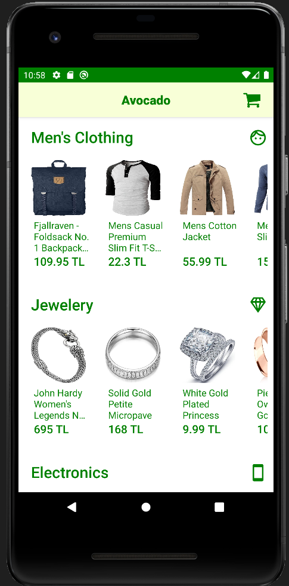

# Avocado

### Ekranlarım

<figure>
    
    <figcaption>Açılış Ekranı</figcaption>
</figure>

<figure>
    
    <figcaption>Anasayfa</figcaption>
</figure>

<figure>
    
    <figcaption>Ürün Ekranı 1</figcaption>
</figure>

<figure>
    
    <figcaption>Ürün Ekranı 2</figcaption>
</figure>

<figure>
    
    <figcaption>Kategori Ekranı</figcaption>
</figure>

<figure>
    
    <figcaption>Sepet Ekranı</figcaption>
</figure>

<figure>
    
    <figcaption>Yüklenme Ekranı</figcaption>
</figure>

<figure>
    
    <figcaption>Hata Ekranı</figcaption>
</figure>
